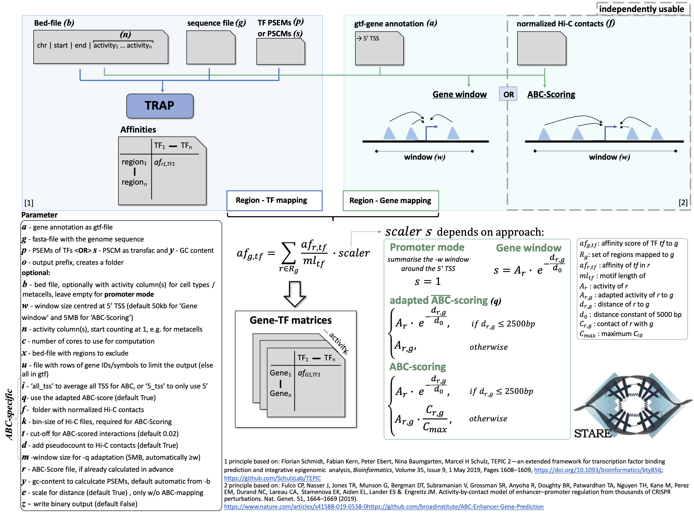

============
Gettings started
============

STARE is a framework that combines two tasks, which can also work independently:

- score enhancer-gene interactions with the Activity-By-Contact (ABC) model
- derive TF affinities for regions
 
For the ABC scoring it only needs annotated candidate enhancer and their activity, and optionally chromatin contact data. STARE can combine the ABC-interactions with the TF affinities in regions to summarise TF affinities on gene level, which allows for a variety of further downstream analyses. Alternatively to using ABC-scored interactions, STARE can also summarise all regions within a defined window, which then doesn't even need a measurement of activity in your regions. If this sounds interesting to you, here's how you get started.

***************
Installing STARE
***************

**Installation with Bioconda**

We wrapped STARE into a Bioconda package which should ease the installation. You can find instructions to set up Bioconda `here <https://bioconda.github.io/>`_, and more details on the `package's website <https://bioconda.github.io/recipes/stare-abc/README.html#package-stare-abc>`_. Once Bioconda is set up you can install STARE either inside or outside of a conda environment::

   conda install stare-abc

Note that if installed with Bioconda, you can call the functions directly, without the preceding "./" or "./Code/".

**Manual installation**

The following tools/libraries must be installed in advance (if not using bioconda):

- `bedtools <https://github.com/arq5x/bedtools2>`_ Please make sure to add the bedtools installation to your path
- openmp for parallel computing; unfortunately, the installation is system-dependent and we didn't yet find a one-size-fits-all solution. MacOS usually also requires llvm. 
- `Boost C++ Library <https://www.boost.org/>`_
- `CMake <https://cmake.org/download/>`_ if you want to use it for compilation, otherwise you need g++.

Once you got all of the above installed, you can clone the GitHub repository::

    git clone https://github.com/SchulzLab/STARE.git

or download the source code and unzip it.

*Compilation with CMake*

The (theoretically) easier way for compilation is to use CMake. To do so, navigate into the /Code directory, and configure the project::
   
   cmake .

If that worked fine you can build the project, which should compile everything for you::

   cmake --build .

*Compilation with predefined commands*

If you don't want to use CMake, there's the option to run scripts with compilation commands for MacOS and Linux based on g++. There are two scripts in **/Code**: *compile_STARE_macOS.sh* and *compile_STARE_Linux.sh* which should compile the C++ scripts for your platform if you run them. The paths are relative, you can call them from any directory::

    ./Code/compile_STARE_macOS.sh

or::

    ./Code/compile_STARE_Linux.sh

*************
Get started and test runs
*************
The following schema should give you an overview of STARE's function and what settings you can tune to run it properly on your data. 

If you want to test your installation and try out some examples, we have the *Code/runTestCases.sh* script for you. It serves the following purposes:

- It gives examples on how to run STARE and which flags to use. To get inspiration have a look at the individual test commands. The list of tests is not exhaustive, you can of course combine the options in a different way.
- It also compares the output of its test runs against pre-computed results in terms of content and quantity to make sure that the installation worked correctly (**/Test/Test_Controls/**). It will tell you with a subtle ERROR message if something went wrong. Test_V16 doesn't have a control, because its output is system-dependent.
- You can see examples of how the input files are formatted in **/Test/Test_Data/**.

To call the tests, you need to give the path to the **/Test/** directory, if you used bioconda for installation you will need to download that folder and you can call the script directly. You'll also have to give a path to where the output should be written to::

    ./Code/runTestCases.sh -i <path to /Test/> -o <output path>

You will get a lot of print-outs and each Test will create a folder in -o. If you didn't get any ERROR messages, you should be good to go and run STARE on your own data.
You can also choose individual tests by giving the respective number, if you don't want to run all of them. For example for Test_V7::

    ./Code/runTestCases.sh -i <path to /Test/> -o <output path> -t 7

NOTE: The tests 12, 13, 14, 17 and 18 are currently bugged in the 1.0.4 release. This is fixed in the GitHub repository and will be included in a new release.

***************
Input and options
***************

A basic STARE run could look as follows (remember with bioconda you can call STARE.sh directly, without giving any path)::

./Code/STARE.sh -b <bed_file> -a <gtf-gene_annotation> -g <fasta_file> -s <PSCM_file> -o <output_folder> 

There are two ways to set the flags for STARE.

Either with a hyphen immediately followed by a one-letter argument, then a whitespace, as shown in the example below::

-b <path_to_bed_file>

**or** via the long-option format with double-hyphen and one equals sign::

--bed_file=<path_to_bed_file>

Do not mix those styles, that won't work. You will notice that the one-character-flags don't always match the first letter of the long-flag. Unfortunately, we ran out of matching letters.

Required input
===============

The table below provides the list of all input data (together with their corresponding arguments) that are mandatory. If you miss one, STARE should notice and tell you. You will find examples for each in **/Test/Test_Data/**.

+------------------------------+--------------------------------------------------------------------------------------------------------------------------------------------------------------------------------------------------------------------------------------------------------------------------------------------------------------------------------------------------------------------------------------------------------------------------------------------------+
|Flag                          |Description                                                                                                                                                                                                                                                                                                                                                                                                                                       |
+==============================+==================================================================================================================================================================================================================================================================================================================================================================================================================================================+
|-a / --annotation             |Gene annotation file in gtf-format (for example from `Gencode <https://www.gencodegenes.org/>`_ the Comprehensive gene annotation for the reference chromosomes). It is advised to give the full annotation and not only a subset in particular when running the generalised ABC-scoring approach as we require the information of all genes.                                                                                                     |
+------------------------------+--------------------------------------------------------------------------------------------------------------------------------------------------------------------------------------------------------------------------------------------------------------------------------------------------------------------------------------------------------------------------------------------------------------------------------------------------+
|-g / --genome                 |Genome fasta file in RefSeq format.                                                                                                                                                                                                                                                                                                                                                                                                               |
+------------------------------+--------------------------------------------------------------------------------------------------------------------------------------------------------------------------------------------------------------------------------------------------------------------------------------------------------------------------------------------------------------------------------------------------------------------------------------------------+
|-p / --psem **or** -s / --pscm|Either one of the provided PSEMs (Position Specific Energy Matrix) or an own PSCM (Position Specific Count Matrix) in transfac format which will then be automatically converted to PSEM using the sequence content of the --bed_file as background. You can optionally also specify a different GC-content with the -y flag as described below. For details see `PSEMs and PSCMs <https://stare.readthedocs.io/en/latest/PSEMs_and_PSCMs.html>`_.|
+------------------------------+--------------------------------------------------------------------------------------------------------------------------------------------------------------------------------------------------------------------------------------------------------------------------------------------------------------------------------------------------------------------------------------------------------------------------------------------------+
|-o / --output                 |Name of the output folder. The folder will be created and can't already exists to prevent overwriting of files. All output files will have the folder name as prefix.                                                                                                                                                                                                                                                                             |
+------------------------------+--------------------------------------------------------------------------------------------------------------------------------------------------------------------------------------------------------------------------------------------------------------------------------------------------------------------------------------------------------------------------------------------------------------------------------------------------+

Other input options
===============

There are more tunable options for STARE, some of which will be explained in more detail below the table, marked with an asterisk (:sup:`*`). Flags that are related to the ABC-mode are labelled accordingly (:sup:`ABC`).

+------------------------------------+-----------------------------------------------------------------------------------------------------------------------------------------------------------------------------------------------------------------------------------------------------------------------------------------+
|Flag                                |Description                                                                                                                                                                                                                                                                              |
+====================================+=========================================================================================================================================================================================================================================================================================+
|-b / --bed_file :sup:`*`            |Bed-file with your non-overlapping candidate regions. If you leave this empty STARE will run in **promoter-mode** instead and construct promoter windows size -w around the 5'TSS to summarise TF affinities. Headers are allowed if they start with # and do not contain whitespaces.   |
+------------------------------------+-----------------------------------------------------------------------------------------------------------------------------------------------------------------------------------------------------------------------------------------------------------------------------------------+
|-w / --window                       |Window size centred at the 5' TSS in which regions from the --bed_file will be considered for a gene (Default 50KB for non-ABC-mode and 5MB for ABC-mode). E.g. 5MB means ±2.5MB around the TSS.                                                                                         |
+------------------------------------+-----------------------------------------------------------------------------------------------------------------------------------------------------------------------------------------------------------------------------------------------------------------------------------------+
|-n / --column :sup:`* & ABC`        |Column(s) in the --bed_file representing the activity of the region. You will get one set of output files for each column. Start counting at 1. Allowed formats are individual columns; column ranges; columns separated by comma as well as a start column with all consecutive columns.|
+------------------------------------+-----------------------------------------------------------------------------------------------------------------------------------------------------------------------------------------------------------------------------------------------------------------------------------------+
|-c / --cores                        |Number of cores to provide for parallel computing. Note that the processing is also heavy on memory.                                                                                                                                                                                     |
+------------------------------------+-----------------------------------------------------------------------------------------------------------------------------------------------------------------------------------------------------------------------------------------------------------------------------------------+
|-x / --exclude_bed                  |Bed-file with regions to exclude. All regions in the --bed_file with ≥ 1 bp overlap will be discarded from all further analyses.                                                                                                                                                         |
+------------------------------------+-----------------------------------------------------------------------------------------------------------------------------------------------------------------------------------------------------------------------------------------------------------------------------------------+
|-u / --genes                        |File with rows of gene IDs/symbols to limit the output to. The respective IDs/symbols must be present in the gtf-file (-a) including all potential version suffixes like ENSG00000164458.5. If you don't give any gene list you will get the result for all genes in the gtf-file.       |
+------------------------------------+-----------------------------------------------------------------------------------------------------------------------------------------------------------------------------------------------------------------------------------------------------------------------------------------+
|-i / --tss_mode :sup:`ABC`          |Set to "all_tss" to average across all annotated TSS for ABC-scoring or "5_tss" to use only the 5' TSS (default "all_tss").                                                                                                                                                              |
+------------------------------------+-----------------------------------------------------------------------------------------------------------------------------------------------------------------------------------------------------------------------------------------------------------------------------------------+
|-q / --adapted_abc :sup:`ABC`       |Whether to use the use the adapted activity for ABC-scoring or the 'original' one (Default True).                                                                                                                                                                                        |
+------------------------------------+-----------------------------------------------------------------------------------------------------------------------------------------------------------------------------------------------------------------------------------------------------------------------------------------+
|-f / --contact_folder :sup:`* & ABC`|Path to directory containing normalized chromatin contact files in coordinate format (bin|bin|contact) one gzipped file for each chromosome. Alternatively set to "false" to instead use a contact estimate based on distance.                                                           |
+------------------------------------+-----------------------------------------------------------------------------------------------------------------------------------------------------------------------------------------------------------------------------------------------------------------------------------------+
|-k / --bin_size :sup:`ABC`          |Resolution of the chromatin contact data. E.g. 5000 for a 5kb resolution.                                                                                                                                                                                                                |
+------------------------------------+-----------------------------------------------------------------------------------------------------------------------------------------------------------------------------------------------------------------------------------------------------------------------------------------+
|-t / --cutoff :sup:`ABC`            |Cut-off for the ABC-score. Only interactions surpassing it are written to the output (Default 0.02). Set to 0 if you would like to get all scored interactions. Interactions with 0 activity/adapted activity are skipped either way.                                                    |
+------------------------------------+-----------------------------------------------------------------------------------------------------------------------------------------------------------------------------------------------------------------------------------------------------------------------------------------+
|-d / --pseudocount :sup:`ABC`       |Whether to use a pseudocount for the contact frequency in the ABC-score (Default True).                                                                                                                                                                                                  |
+------------------------------------+-----------------------------------------------------------------------------------------------------------------------------------------------------------------------------------------------------------------------------------------------------------------------------------------+
|-m / --enhancer_window :sup:`ABC`   |Size of the window around your candidate regions in which genes are considered for the adapted activity adjustment (Default 5MB; will be minimally set to -w).                                                                                                                           |
+------------------------------------+-----------------------------------------------------------------------------------------------------------------------------------------------------------------------------------------------------------------------------------------------------------------------------------------+
|-r / --existing_abc :sup:`*`        |Path to an existing ABC-scoring file if you already calculated one.                                                                                                                                                                                                                      |
+------------------------------------+-----------------------------------------------------------------------------------------------------------------------------------------------------------------------------------------------------------------------------------------------------------------------------------------+
|-y / --gc_content                   |GC-content on which the conversion of PSCM (-s) to PSEM (-p) should be based on. By default the automatically determined base content of the --bed_file is used.                                                                                                                         |
+------------------------------------+-----------------------------------------------------------------------------------------------------------------------------------------------------------------------------------------------------------------------------------------------------------------------------------------+
|-e / --decay                        |Whether exponential distance decay should be used for scaling the TF affinities in the non-ABC-mode (Default True). Does not affect behaviour for the ABC-mode (see `Affinity summarisation <https://stare.readthedocs.io/en/latest/Affinity_Summarisation.html>`_).                     |
+------------------------------------+-----------------------------------------------------------------------------------------------------------------------------------------------------------------------------------------------------------------------------------------------------------------------------------------+
|-z / --reshape                      |Write the output in binary format (default False). For details see `Binary output <https://stare.readthedocs.io/en/latest/Binary_Reshape.html>`_.                                                                                                                                        |
+------------------------------------+-----------------------------------------------------------------------------------------------------------------------------------------------------------------------------------------------------------------------------------------------------------------------------------------+
|-h / --help                         |Print the flag options.                                                                                                                                                                                                                                                                  |
+------------------------------------+-----------------------------------------------------------------------------------------------------------------------------------------------------------------------------------------------------------------------------------------------------------------------------------------+
|-v / --version                      |Print the current version.                                                                                                                                                                                                                                                               |
+------------------------------------+-----------------------------------------------------------------------------------------------------------------------------------------------------------------------------------------------------------------------------------------------------------------------------------------+

-b / --bed_file
------------------

It is possible to leave this flag empty, causing STARE to run in **promoter-mode** and to construct promoter windows of size -w around the 5'TSS of genes and summarising the TF affinities in those, without any scaling. It is recommended however, to have candidate regulatory elements, as they promise more information than simply taking the promoter region and can be used for ABC-scoring as well. Headers are allowed if they start with #. Usually non-overlapping regions make most sense. The chromosome column can either have the chr-Prefix or not, but it must be consistent within the file.

-n / --column
------------------

-n / --column points to an activity column or multiple activity columns in the --bed_file. For once, this is required for the 'A' in ABC-score. This can be the read counts of DNase-seq, ATAC-seq, H3K27ac ChIP-seq, or any other measurement which represents enhancer activity. You can also use other metrics, like enrichment scores or -log(p-values), as long as it is comparable between peaks and indicates how active an enhancer is. Any combination of measurements is of course also possible.

But why multiple columns? You can specify multiple columns if you have data from multiple cell types/samples with one unified set of candidate regions, but multiple activity measurements. This can be either on the level of individual cells, aggregated cells, like metacells, or cell types. The figure below should illustrate this idea. You can also see examples how to select columns with the -n flag.

As of now, there is no option to use chromatin contact data on single-cell level. You would have to create your own interaction file (see below in the section about the --existing-abc). Also, if you have a separate set of regions for each cell, you would have to call STARE separately for each one.

-f / --contact_folder
------------------

STARE expects a gzipped file of contact data for each chromosome. The contact frequencies should already be normalized. The format within the gzipped file should be tab-separated with the first bin, second bin, and their contact frequency without any header::

    5000    20000    4.2

We provide a small bash script that can produce those files from a .hic-file, using `Juicer's data extraction <https://github.com/aidenlab/juicer/wiki/Data-Extraction>`_. After installation of Juicer you can call the script via::

   ./Code/Juicebox_KR_normalization.sh -j <path_juicer_jar_file> -h <hic_path> -d <out_path> -c <chromosomes> -b <bin_size>

Specifying the chromosomes is optional, by default chr1-22 will be written. You can give a range or individual ones as comma-separated (e.g. 1-22 or 1,5,7,X). Be aware that we currently don't catch all combinations of chromosome options. Bin size defaults to 5kb. 

If you don't have matching contact data at hand, the average hg19 Hi-C matrix provided by `Fulco et al. (2019) <https://doi.org/10.1038/s41588-019-0538-0>`_ was always a good substitution in our hands (ftp://ftp.broadinstitute.org/outgoing/lincRNA/average_hic/average_hic.v2.191020.tar.gz, ~20GB, folder structure has to be adapted as described above).

Another option is to set the -f flag to "false". In this case, a contact estimate based on a fractal globule model is used (see `Lieberman-Aiden et al. 2009 <https://doi.org/10.1126/science.1181369>`_). That uses the inverse of the distance. We added an offset of 5kb for the ABC-scoring, so that the contact c at distance d becomes:

   c = max\{d, 5000\} :sup:`-1` .

-r / --existing_abc
------------------
If you have multiple files matching the columns specified with -n just give the path to one of them and STARE will search the directory to find the other files matching to the remaining columns, given that they end with their column suffix and txt.gz, for example "Test_V7_ABCpp_scoredInteractions_pan_cake.txt.gz". This of course omits the need to provide the other ABC-flags. In theory you can also give a region-gene mapping on your own. If you do so, the file requires three columns with the following headers:

- *Ensembl ID*: Must match the ones from the --annotation file. 
- *PeakID*: Has the format chr:start-end and must match the row names in the TRAP affinity file, as well as the locations in the --bed_file. This column is used by STARE to find the region in the bed-file to get its activity. If the region is on chr21 from 1200-1600, the 'PeakID' should be 21:1200-1600. Whether there is a chr-prefix or not should be consistent.
- *intergenicScore*: Will be used to scale the affinities when summarising them on gene level. It depends on how the ABC-scoring was done. If the ABC-scoring was run with the adapted activity (-q True), then the 'intergenicScore' in the ABC result file is the same as the column 'adaptedActivity'. However, if it was run without the adapted activity (-q False), then the 'intergenicScore' is the activity of a region multiplied with the contact divided by the maximum contact found. The equations can be found  `here <https://stare.readthedocs.io/en/latest/Affinity_Summarisation.html`_ as part of the 'otherwise' condition in the equations under 'ABC-scoring' and 'Not-adapted ABC-scoring', respectively.

***************
Output
***************

The output depends on your input and the options you chose. Although you might not produce all files that are listed, the overall structure is similar. Let's pretend you set the -o flag to *Pancake* so that we can have the full paths as example.

- You will always get a **metadata** file *Pancake_metadata.amd.tsv*, which lists the flags you set, and the command you used to call STARE.

ABC output
===============

You will get two files for each activity column you gave, one with all the interactions surpassing the set cut-off -t, and one summarising a variety of features for each gene. If -i / --tss_mode was set to all_tss, the columns are averaged across TSS. See the description of the columns below.

.. image:: ../Figures/STARE_ABCOutput_Tables.png
  :alt: STARE_ABC_Tables
  :target: https://github.com/SchulzLab/STARE/blob/main/Figures/STARE_ABCOutput_Tables.pdf

You can also call the ABC-part independently, without producing a gene-TF matrix, see `Separate ABC <https://stare.readthedocs.io/en/latest/Separate_ABC.html>`_.

Gene-TF-matrices
===============

The gene-TF-matrices will always have the same format.

 - *Pancake_TF_Gene_Affinities.txt.gz*: Matrix of TF affinities summarised per gene, with the genes as rows and TFs as columns. It has three additional columns with the number of peaks considered for the gene, the average peak distance and the average peak size.
 - *Pancake_discarded_Genes.txt*: Lists all genes where no TF affinities could be calculated, with a note indicating why.

Output per activity column (-n)
===============

You will get one set of output files for each activity column. The files will be named according to the header of those columns, or according to their index, if you didn't have a header. For example, if one of your activity columns was named *sirup*, your gene-TF matrix file would be *Pancake_TF_Gene_Affinities_sirup.txt.gz*.

***************
Computational power and parallelisation
***************

As you can imagine depending on the number of peaks, genes and activity columns, the calculations can get quite heavy on a computer's memory. In general, unsurprisingly, it is advisable to run STARE on a computer cluster. We aimed to have STARE running efficiently, which also means that some parts can be run in parallel. Note however, that especially for the ABC-scoring part, more provided cores will also mean more required memory. The read-in of the chromatin contact data is by far the most time-consuming part, which is why we decided to have this in parallel. However, if there are more than 200 activity columns the memory required for multiple chromosomes is quite high, and thus, the parallelization switches from chromosomes to batches of genes. If you don't have that much RAM available, set the number of cores to 1. It also depends on how sparse the contact data is. For example, reading chr1 of a K562 Hi-C data set requires ~1.2 GB, while it takes ~11.6 GB from the average Hi-C matrix from Fulco et al. (2019).

