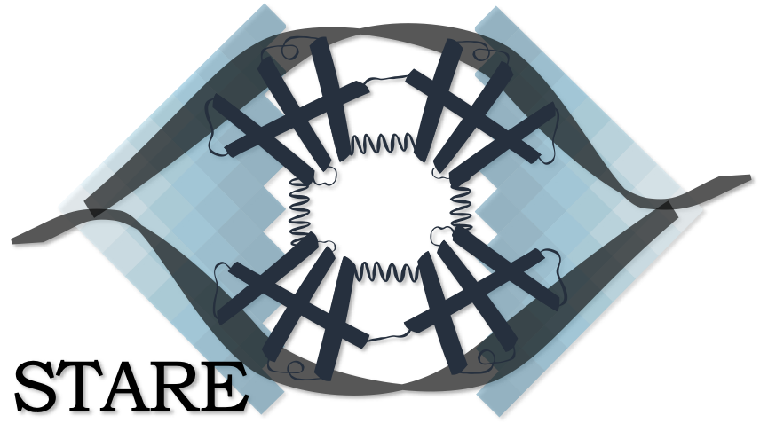

STARE - Look into TF regulation on gene level leveraging an adapted Activity-By-Contact score
===========================================================================

.. toctree::
      :maxdepth: 2
   
   Main.rst
   PSEMs_and_PSCMs.rst
   Affinity_Summarisation.rst
   Separate_ABC.rst
   Troubleshooting.rst
